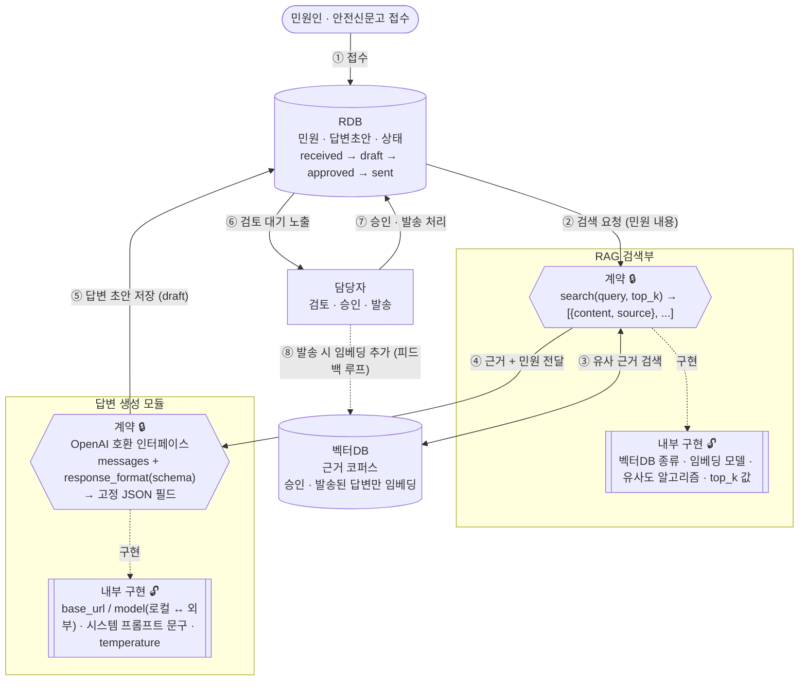

# 안전신문고 민원 답변 자동화 — 아키텍처

> 원본: 인수인계 문서(프로토타입 단계, Python 기준)를 NestJS 재작성 기준으로 옮긴 것.
> 이 문서는 **목표 구조와 지켜야 할 원칙**을 정의한다. 구현 세부(엔드포인트, 환경변수, 테스트)는 `backend-spec.md`가 정한다.
> 두 문서가 충돌하면 작업을 멈추고 질문한다.

## 1. 데이터 흐름

번호(①~⑧)는 실제 처리 순서다.

## 2. 설계 원칙

**인터페이스 계약(입출력 스펙)은 고정이고, 그 계약만 지키면 내부 구현은 자유롭게 바꿔도 된다.**

| 표기 | 의미 |
|---|---|
| 🔒 계약 | 입출력 스펙이 고정된 경계. 이름·필드·타입을 바꾸면 파이프라인 전체가 깨진다. |
| 🔓 내부 구현 | 계약만 지키면 알고리즘·모델·문구·파라미터를 자유롭게 바꿔도 된다. |
| 저장소(RDB, 벡터DB) | 상태 전이 규칙과 "무엇을 저장하는가"의 정의가 계약에 해당한다. |
| 담당자 | 자동화가 아니라 사람이 직접 판단·승인하는 지점. |

## 3. 절대 바꾸면 안 되는 것

1. **생성 출력 JSON 필드** — 답변 후보: `answer`, `approach`, `used_sources`, `assumptions` / 응답: `is_info_sufficient`, `insufficient_reason`.
   필드 이름 변경·추가·삭제 금지.
   *왜* — 저장 로직과 화면 표시 로직이 전부 이 필드 이름을 그대로 참조한다. 하나만 바뀌어도 이미 저장된 초안과 새 초안의 구조가 달라져 조용히 깨진다.
2. **`search(query, top_k)`의 입출력 형태** — 입력: 문자열 쿼리 · top_k. 출력: `[{ content, source }, ...]`.
   *왜* — 이 형태를 지켜야 생성 쪽 코드를 건드리지 않고 검색부만 갈아 끼울 수 있다.
3. **벡터DB 임베딩 대상: "승인 · 발송된 답변만"** — draft나 반려된 답변은 절대 임베딩하지 않는다.
   *왜* — 이 시스템에서 가장 중요한 불변식이다. 검증 안 된 초안이 근거 코퍼스에 섞이면, 다음 생성이 그 초안을 근거로 삼고
   그 결과가 다시 임베딩되는 식으로 품질이 스스로 나빠진다. 되돌리기도 어렵다(오염된 항목을 골라내야 함).
4. **RDB 상태 전이 순서: `draft → approved → sent`** — 담당자 승인 없이 draft가 바로 sent로 넘어가거나,
   임베딩 트리거가 승인 이전 단계에 붙는 구조로 바꾸지 않는다.
   *왜* — 이 순서가 곧 "사람 검토를 거친 것만 근거가 된다"는 안전장치다.
5. **OpenAI 호환 요청 형태**(`messages` 배열, `response_format` 파라미터명).
   *왜* — "엔드포인트만 바꿔서 모델을 교체한다"는 설계의 전제다.

## 4. 자유롭게 바꿔도 되는 것

위 계약만 지키면 아래는 실험적으로 바꿔도 안전하다. 바꿔가며 실험하라고 분리해 둔 부분이다.

- 모델 · 엔드포인트 (환경변수만으로 로컬 ollama ↔ 외부 고사양 모델 전환)
- 시스템 프롬프트 문구, 스키마 description 문구 — 단, 5번의 실측 경고를 먼저 읽을 것
- 생성 파라미터(temperature, max_tokens)와 ollama 전용 옵션(keep_alive, num_ctx, num_thread)
- 벡터DB 실제 구현체, 임베딩 모델, 유사도 알고리즘, top_k 값
- RDB 실제 엔진, 계약에 없는 부가 컬럼 (민원 · 답변초안 · 상태 세 개념만 유지)

## 5. 자주 터질 문제와 확인 순서

> **실측 사례**: 시스템 프롬프트에서 분량·형식 지시("5문장 이내" 등)를 전부 빼고 스키마 description에만 남겼더니,
> 3b 모델 답변이 길이 통제를 잃고 max_tokens에서 JSON이 중간에 잘렸다(`finish_reason: length`).
> 시스템 프롬프트와 description 중 한쪽을 통째로 비우면 재현된다.

- **생성 결과가 JSON 파싱 에러로 죽는다**
  1. 토큰 수가 max_tokens에 딱 걸렸는지 확인.
  2. 최근에 시스템 프롬프트를 줄이고 description만 늘리지 않았는지 확인.
  3. 모델을 바꿨다면 `json_schema` 지원 여부 확인 — 미지원 시 `json_object` 폴백을 타는지 로그로 확인.
- **로컬 ollama가 호출마다 느리다 / 모델이 매번 재로딩된다**
  1. keep_alive 옵션이 실제로 전달되는지 확인.
  2. `ollama list`로 모델이 pull되어 있는지 확인.
- **검색 결과(근거)가 이상하다**
  1. 벡터DB에 draft나 반려된 답변이 잘못 임베딩되지 않았는지 확인.
  2. 임베딩 트리거가 정말 "발송" 이벤트에만 붙어 있는지 재확인(3번의 불변식).
- **답변이 규칙을 어긴다** (예: 유예 시간에 단속한다고 씀, 다른 언어가 섞임)
  1. 코드 버그가 아니라 모델 한계일 수 있다 — 코드부터 뒤지지 말 것.
  2. 같은 입력으로 2~3번 재실행해 재현율부터 확인.
  3. 반복되면 스키마 description을 더 구체적으로 다듬거나 모델별로 프롬프트 강도를 조정.
- **모델을 바꿨더니 전체가 예외를 던진다**
  1. `json_schema → json_object` 폴백을 타는지 확인.
  2. 그래도 안 되면 새 엔드포인트가 OpenAI 호환 스펙 자체를 안 지키는지부터 구분.

## 6. AI에게 코드 수정을 시켰다면 반드시 확인할 것

- [ ] 3번의 계약 필드(스키마 required, 필드명)가 diff에서 그대로인지 눈으로 확인했다. "타입체크 통과"와 "필드가 안 바뀜"은 다르다.
- [ ] `search()` / 생성 호출 함수의 파라미터 이름·순서가 유지됐다. AI는 리팩터링하며 시그니처를 슬쩍 바꾸는 경우가 있다.
- [ ] 실제 엔드포인트로 한 번 돌려 정상 동작을 확인했다(스모크 스크립트).
- [ ] 답변 본문을 눈으로 읽고 모델이 규칙을 "지키는 대신 언급"하지 않는지 확인했다("저는 규칙에 따라~" 같은 메타 발화).
- [ ] 시스템 프롬프트와 스키마 description을 "동시에" 늘리지 않았다. 한쪽을 늘렸다면 다른 쪽은 그대로 두거나 줄인다.

## 7. 배포 · 데이터 · 서버

- 운영 서버에 ollama가 떠 있고 필요한 모델이 pull되어 있는지 확인.
- 환경별(로컬 · 개발 · 운영) 엔드포인트·API 키·모델 값이 섞이지 않았는지 확인. 운영에 개발용 외부 API 키가 남아 있으면 안 된다.
- 벡터DB(근거 코퍼스) 백업 체계 확인. 이 코퍼스가 사실상 서비스 품질 그 자체다.
- 민원 원문에 이름·연락처·차량번호 등이 들어올 수 있다는 전제로 로그·백업을 점검한다. 로그에 평문으로 남기지 않는다.
- CPU 자원 값(num_thread 등)이 실제 서버 코어 수에 맞는지 확인한다. DB 등 다른 프로세스와의 자원 경합을 고려한다.
